# Relatorio Executivo - Brazilian E-Commerce

## Analise de Desempenho Comercial, Logistico e Satisfacao do Cliente

**Periodo analisado:** 2016 - 2018
**Base de dados:** Brazilian E-Commerce Public Dataset by Olist (~100 mil pedidos)
**Publico-alvo:** Investidores e acionistas do setor de e-commerce

---

## Sumario Executivo

O e-commerce brasileiro analisado demonstrou **crescimento expressivo** no periodo, atingindo uma receita total de **R$ 15,7 milhoes** com mais de **98 mil pedidos** processados. A plataforma atende **93,3 mil clientes unicos** em todo o territorio nacional, com destaque para o estado de Sao Paulo, responsavel por quase metade da receita.

A operacao logistica apresenta uma **mediana de entrega de 10,2 dias**, com taxa de atraso controlada em **8,1%**. A satisfacao dos clientes e elevada, com score medio de **4,16/5** e NPS de **66,1** (zona de excelencia). No entanto, a taxa de recompra de apenas **3,0%** representa o principal desafio e a maior oportunidade de crescimento.

### KPIs Principais

| Indicador | Valor |
|---|---|
| Receita Total | R$ 15.735.285,95 |
| Total de Pedidos | 98.200 |
| Ticket Medio | R$ 160,24 |
| Clientes Unicos | 93.358 |
| Mediana Lead Time | 10,2 dias |
| Taxa de Atraso | 8,1% |
| Score Medio | 4,16 / 5,0 |
| NPS Geral | 66,1 |
| Taxa de Recompra | 3,0% |

---

## 1. Crescimento e Receita

### Evolucao do Negocio

O e-commerce brasileiro apresentou uma **trajetoria de crescimento acelerado** entre 2016 e 2018, saindo de algumas centenas de pedidos mensais para picos superiores a 7 mil pedidos/mes. Esse crescimento reflete a adocao crescente do marketplace por lojistas e consumidores em todo o Brasil.

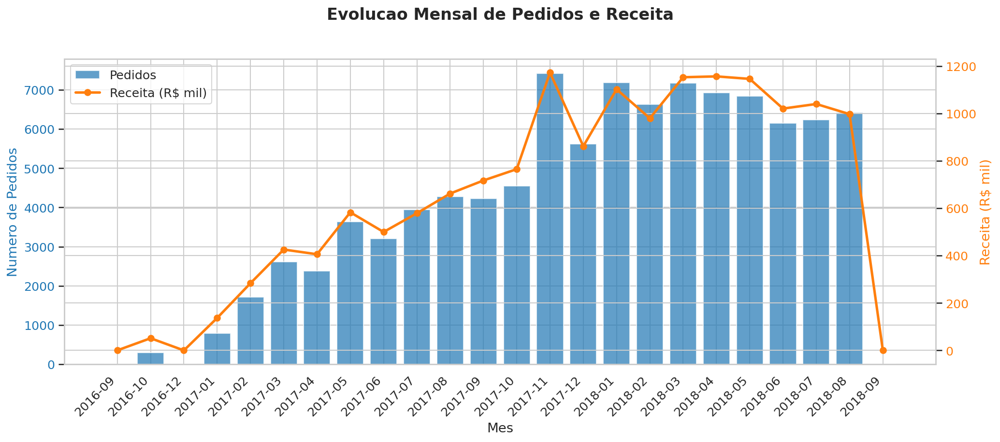

O ticket medio se manteve **estavel** ao longo do periodo, em torno de R$ 160, indicando que o crescimento da receita foi impulsionado principalmente pelo **aumento no volume de pedidos**, nao por inflacao de precos.

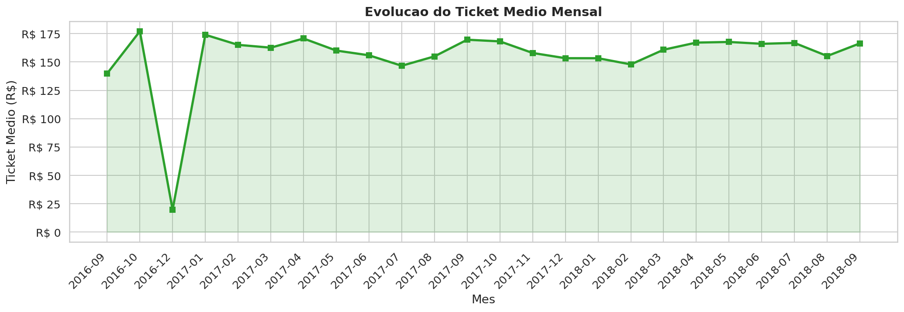

### Categorias e Regioes

As categorias **bed_bath_table**, **health_beauty** e **sports_leisure** lideram em receita, representando as categorias de maior penetracao no marketplace. Ha uma diversificacao saudavel entre categorias, sem dependencia excessiva de um unico segmento.

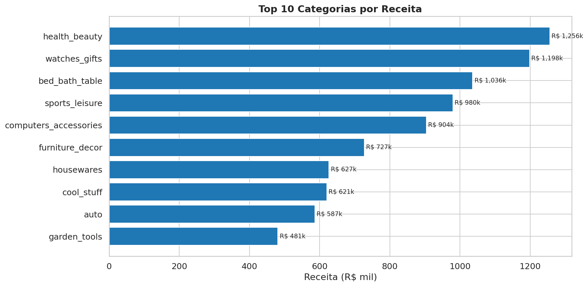

Geograficamente, **Sao Paulo (SP)** concentra a maior fatia da receita, seguido por Rio de Janeiro (RJ) e Minas Gerais (MG). Os tres estados juntos representam a grande maioria do faturamento, refletindo o perfil de consumo digital brasileiro.

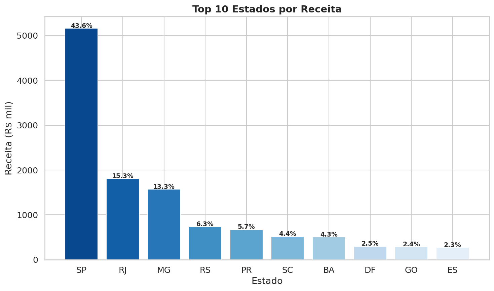

### Sellers Top Performers

Os top 10 sellers geram receitas significativas, demonstrando que o marketplace conta com vendedores ancora que sustentam boa parte da operacao.

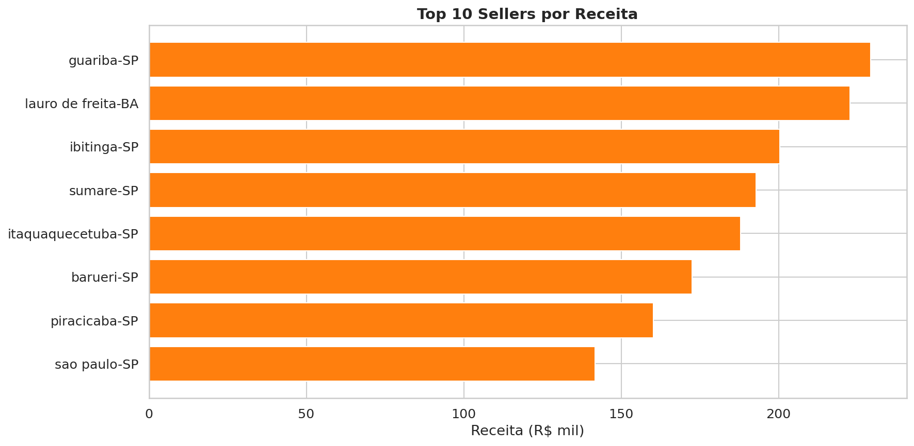

---

## 2. Logistica e SLA

### Performance de Entrega

A logistica e um diferencial competitivo critico no e-commerce. A base analisada apresenta uma **mediana de entrega de 10,2 dias**, com a maioria dos pedidos entregues dentro de 15 dias.

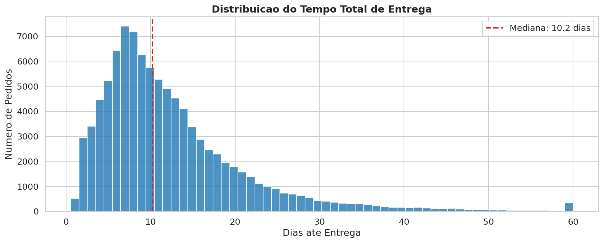

A analise por etapa revela que o **transporte** e o componente mais variavel do processo, enquanto a aprovacao e postagem sao relativamente rapidas.

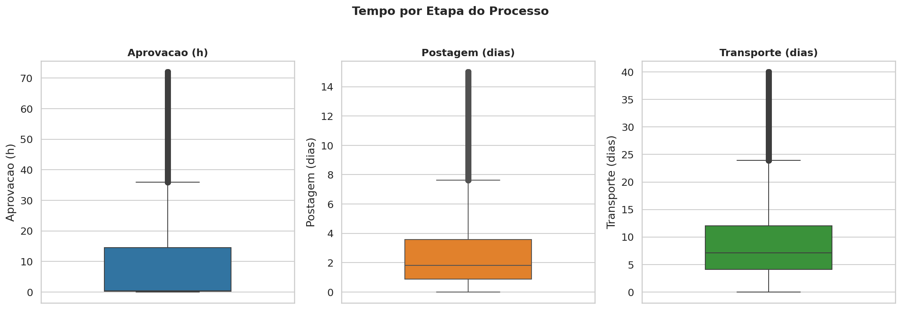

### Impacto dos Atrasos na Satisfacao

A correlacao entre atrasos e insatisfacao e **inequivoca**: pedidos atrasados recebem scores significativamente menores. Enquanto pedidos no prazo recebem score medio proximo de 4,3, pedidos atrasados caem para cerca de 2,5. Isso confirma que **investir em logistica e investir em satisfacao**.

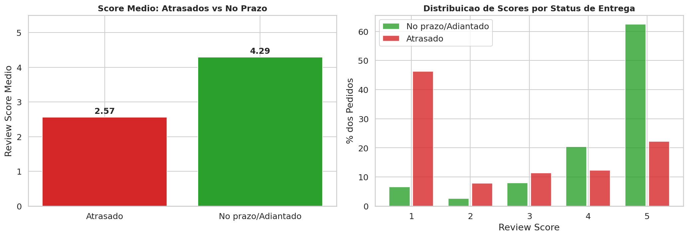

### Desempenho Regional

A taxa de atraso varia significativamente por estado, com regioes mais distantes dos centros logisticos apresentando maiores desafios. Esta analise indica onde investimentos em logistica regional teriam maior retorno.

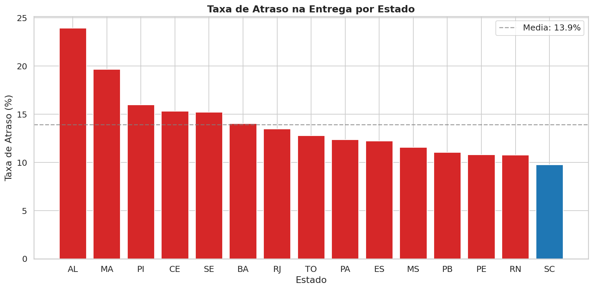

O lead time mediano vem se mantendo relativamente estavel ao longo dos meses, o que sugere que a operacao logistica vem escalando de forma proporcional ao crescimento.

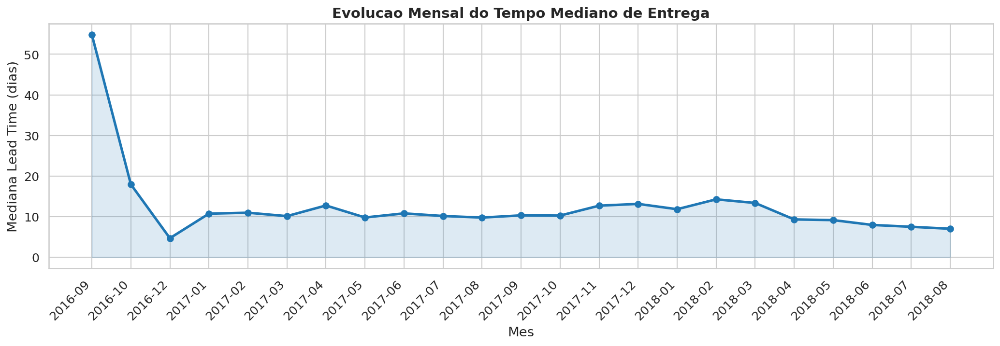

---

## 3. Comportamento e Pagamentos

### Meios de Pagamento

O **cartao de credito** domina com **73,9% das transacoes**, seguido pelo boleto bancario. O parcelamento e amplamente utilizado, com a maioria das compras em ate 3x, mas compras de maior valor chegam a 10-12x.

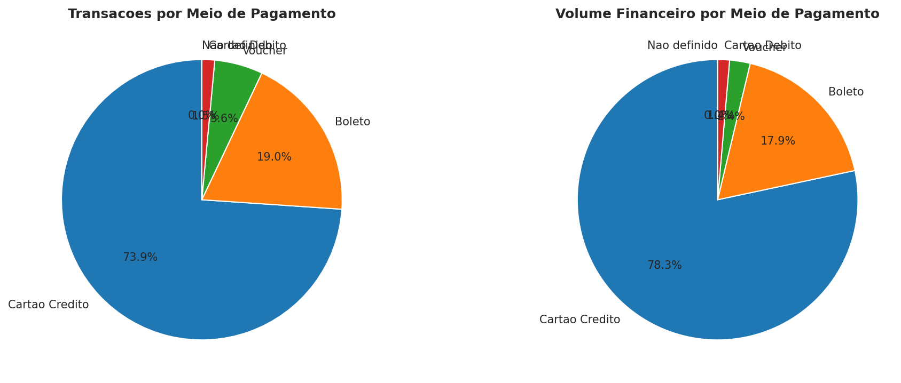

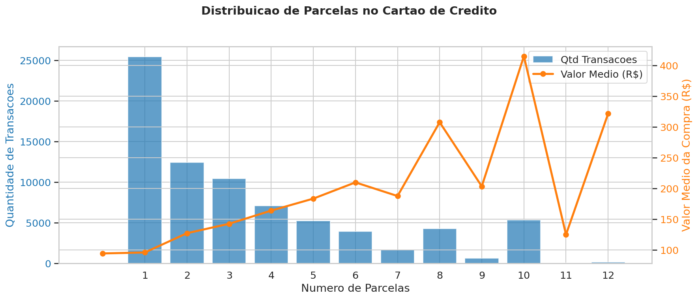

### Segmentacao RFM (Recencia, Frequencia, Monetizacao)

A analise RFM segmentou os clientes em 5 grupos. A grande maioria se encontra nos segmentos "Potential" e "At Risk", refletindo a **baixa taxa de recompra** de 3%. Os "Champions" representam uma parcela pequena mas de altissimo valor.

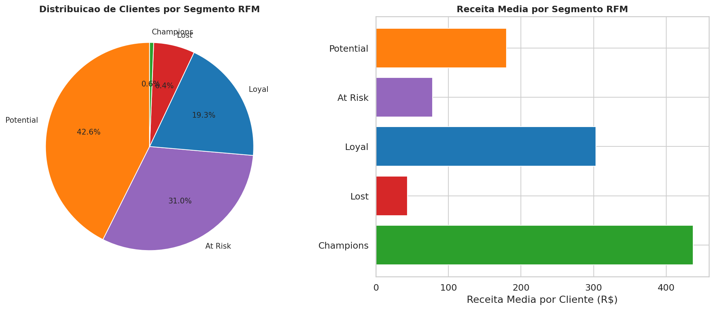

### Retencao e Recompra

A taxa de recompra de **apenas 3,0%** e o principal ponto de atencao. Isso significa que **97% dos clientes compram apenas uma vez**. Programas de fidelidade, comunicacao pos-venda e incentivos para segunda compra representam a maior alavanca de crescimento do negocio.

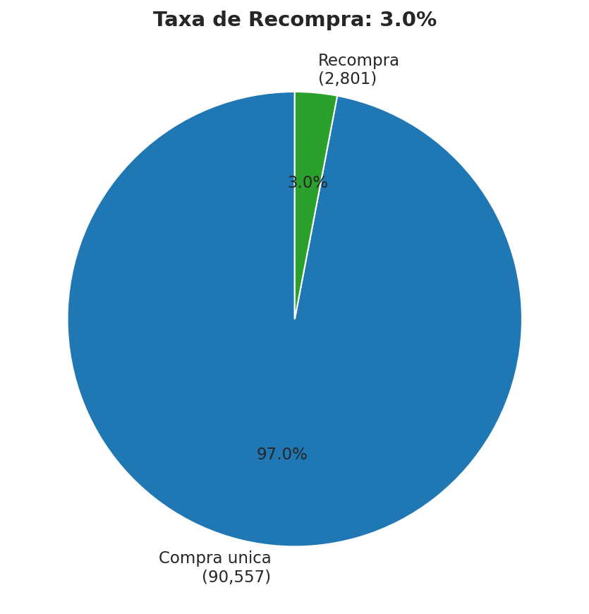

---

## 4. Satisfacao do Cliente

### Distribuicao das Avaliacoes

A distribuicao de reviews e positiva, com **59,2% dos clientes dando nota 5** e score medio de 4,16. No entanto, existe uma parcela relevante de notas 1 (insatisfacao), que merece atencao.

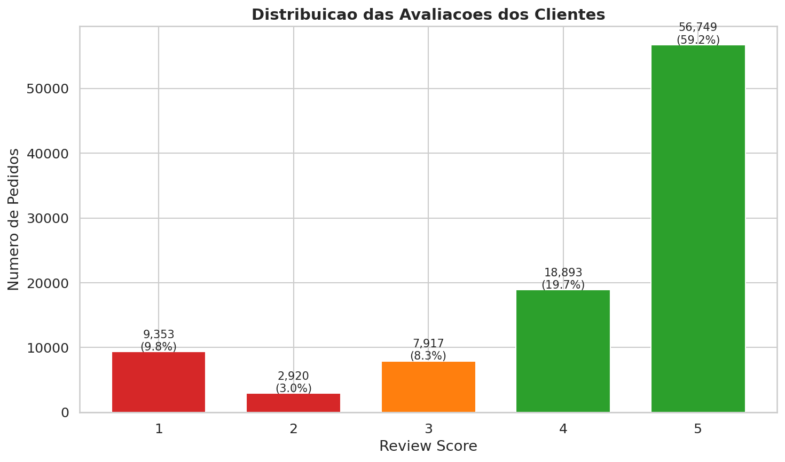

### Score por Categoria

As categorias apresentam niveis variados de satisfacao. Categorias ligadas a bem-estar e moda tendem a ter scores mais altos, enquanto categorias com maior complexidade logistica apresentam desafios.

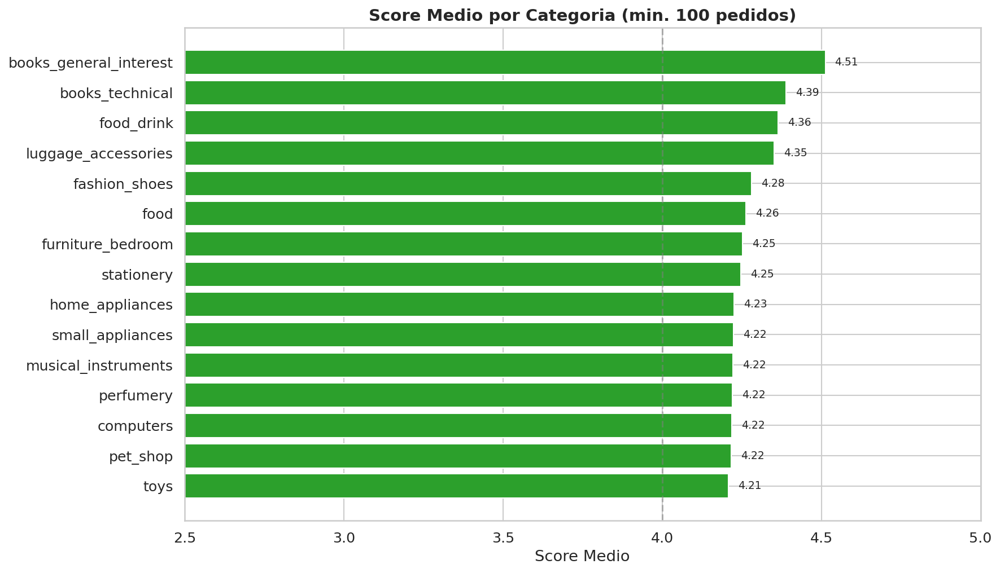

### Drivers de Satisfacao

O **tempo de entrega e o principal driver de satisfacao/insatisfacao**. Entregas em ate 5 dias geram scores proximos de 4,5, enquanto entregas acima de 30 dias caem drasticamente. O preco do pedido tem impacto moderado, com uma leve tendencia de scores melhores para compras de maior valor.

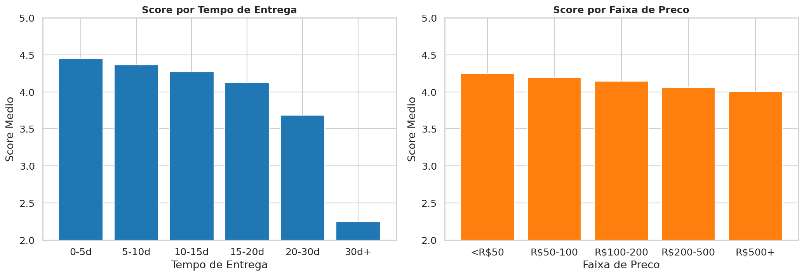

### Evolucao do NPS

O NPS (Net Promoter Score) se manteve predominantemente na **zona de excelencia (acima de 50)**, com um NPS geral de 66,1. Isso indica que o marketplace consegue gerar mais promotores do que detratores.

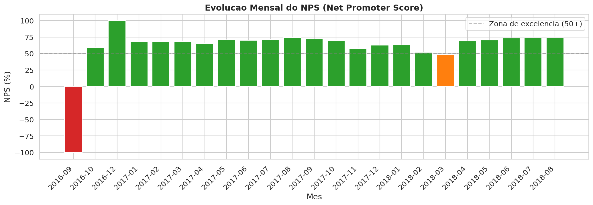

---

## 5. Oportunidades e Recomendacoes

### Otimizacao de Frete

Algumas categorias apresentam frete desproporcional em relacao ao preco do produto. Categorias onde o frete representa mais de 30% do valor do produto sao candidatas a otimizacao logistica (centros de distribuicao regionais, parcerias com transportadoras).

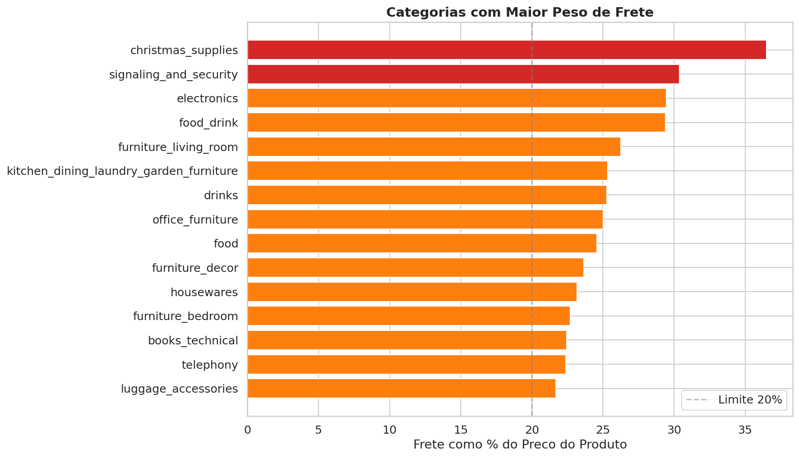

### Priorizacao de Sellers

A matriz Score vs Lead Time dos sellers revela que **61,5% dos sellers** ja operam na zona ideal (score >= 4, lead time <= 15 dias). A recomendacao e:
- **Premiar** sellers na zona ideal com maior visibilidade
- **Capacitar** sellers na zona critica (lentos e mal avaliados) ou considerar descredenciamento

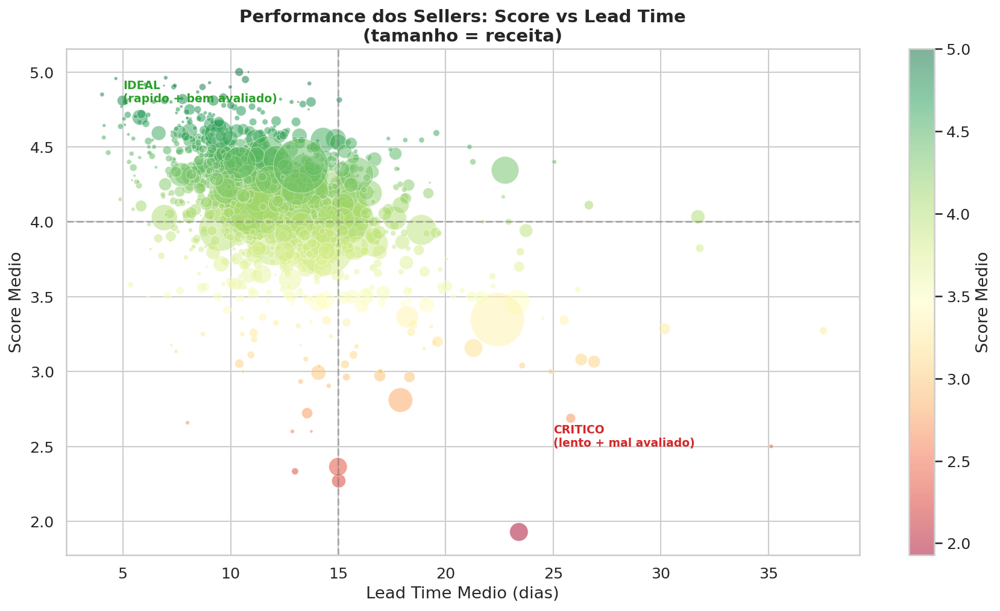

### Oportunidades de Cross-Sell

A analise de categorias compradas conjuntamente revela padroes de cross-sell que podem ser explorados em recomendacoes de produto e campanhas direcionadas.

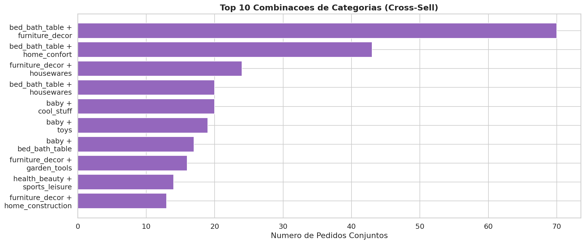

### Mapa de Oportunidade por Regiao x Categoria

O heatmap de receita por estado e categoria mostra concentracoes que podem orientar estrategias de marketing regional e expansao de sortimento.

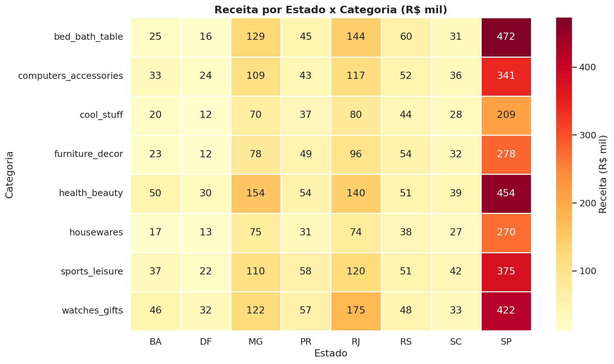

### Projecao de Receita

Com base na tendencia linear observada, a projecao para os proximos 6 meses indica continuidade do crescimento. A trajetoria sustenta a tese de investimento no marketplace.

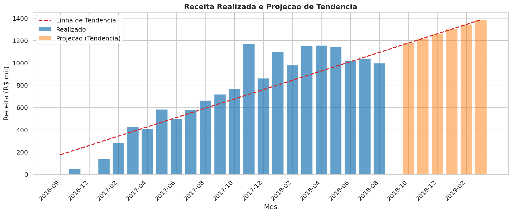

---

## Conclusoes e Recomendacoes Estrategicas

### Pontos Fortes
1. **Crescimento acelerado** - Volume de pedidos em expansao consistente
2. **Alta satisfacao** - NPS de 66,1 e score medio de 4,16
3. **Diversificacao** - Boa distribuicao entre categorias e regioes
4. **Logistica controlada** - Taxa de atraso de 8,1% e melhoria continua

### Oportunidades Prioritarias

| Prioridade | Acao | Impacto Esperado |
|---|---|---|
| 1 | **Programa de retencao/recompra** - A taxa de 3% e a maior alavanca. Implementar email marketing pos-venda, cupons de segunda compra e programa de fidelidade | Potencial de dobrar o LTV dos clientes |
| 2 | **Otimizacao logistica regional** - Centros de distribuicao nas regioes Norte/Nordeste para reduzir lead time e atrasos | Reducao de 20-30% nos atrasos regionais |
| 3 | **Gestao de sellers** - Programa de capacitacao para sellers com baixo score e premiacoes para top performers | Aumento do score medio e reducao de churn |
| 4 | **Cross-sell inteligente** - Recomendacoes baseadas nos padroes de compra conjunta identificados | Aumento de 5-10% no ticket medio |
| 5 | **Otimizacao de frete** - Negociacao de tarifas para categorias com frete desproporcional | Aumento na conversao de categorias sensíveis a frete |

### Riscos Identificados
- **Dependencia de SP/RJ** - Concentracao geografica alta
- **Recompra baixíssima** - Sem retencao, o crescimento depende exclusivamente de aquisicao de novos clientes
- **Atrasos impactam satisfacao** - Correlacao direta entre atraso e notas 1-2

---

## Governanca de Dados

- **Fonte:** Brazilian E-Commerce Public Dataset by Olist (Kaggle)
- **Periodo:** Set/2016 a Out/2018
- **Volume:** ~100.000 pedidos, 9 tabelas interconectadas
- **Tratamento:** Dados anonimizados pelo fornecedor. Limpeza incluiu tratamento de nulos, conversao de tipos, merge entre tabelas e filtragem de outliers
- **Reproducibilidade:** Todo o codigo esta disponivel no repositorio, com scripts modulares e documentados
- **Ferramentas:** Python 3.12, pandas, matplotlib, seaborn, numpy

---

*Relatorio gerado automaticamente a partir da analise do Brazilian E-Commerce Public Dataset by Olist.*
*Tech Challenge - Pos-graduacao*
